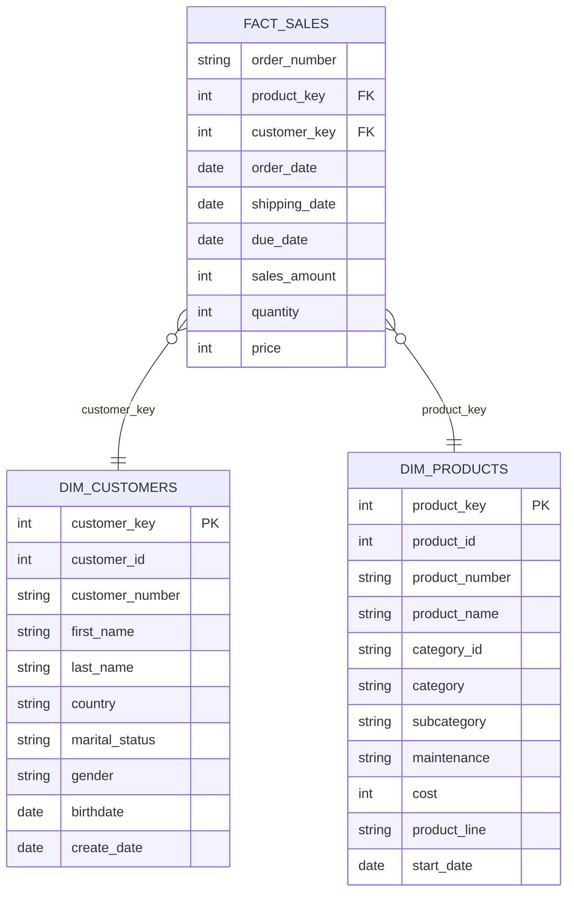

# SQL Data Warehouse Analytics


Exploratory and analytical SQL project built on a star-schema sales data
warehouse (AdventureWorks-style dataset). Covers everything from basic
aggregation to window-function-based trend analysis, customer segmentation,
and a production-style reporting view.

## Table of Contents

- [Dataset](#dataset)
- [Data Model](#data-model)
- [Tech](#tech)
- [Project Structure](#project-structure)
- [Analyses](#analyses)
  - [1. Yearly Sales Summary](#1-yearly-sales-summary)
  - [2. Cumulative Analysis](#2-cumulative-analysis)
  - [3. Product Performance Analysis](#3-product-performance-analysis)
  - [4. Part-to-Whole Analysis](#4-part-to-whole-analysis)
  - [5. Product Cost Segmentation](#5-product-cost-segmentation)
  - [6. Customer Report View](#6-customer-report-view)
- [Sample Insight](#sample-insight)
- [How to Run](#how-to-run)
- [Notes](#notes)

## Dataset

| Table            | Grain                  | Rows   |
|-------------------|-------------------------|-------:|
| `fact_sales`      | one row per order line | 60,398 |
| `dim_customers`   | one row per customer    | 18,484 |
| `dim_products`    | one row per product     | 295    |

- Order dates span **Dec 2010 – Jan 2014**
- Total sales across the period: **$29.36M**
- Customers across 6 countries: Australia, United States, Canada, Germany,
  United Kingdom, France

## Data Model



<details>
<summary><strong>Full column-level breakdown</strong> (click to expand)</summary>

See [`docs/data_model.md`](docs/data_model.md) for the standalone version of
this diagram plus the table above.

</details>

## Tech

- **T-SQL** (SQL Server / Azure Data Studio syntax — `DATETRUNC`, `DATEDIFF`,
  window functions, CTEs)
- CSV source data, loaded into a `gold` schema for analysis

## Project Structure

```
sql-data-warehouse-analytics/
├── datasets/                       # Source CSVs
│   ├── dim_customers.csv
│   ├── dim_products.csv
│   └── fact_sales.csv
├── scripts/                        # Analysis scripts, run independently or in order
│   ├── 01_yearly_sales_summary.sql
│   ├── 02_cumulative_analysis.sql
│   ├── 03_product_performance_analysis.sql
│   ├── 04_part_to_whole_analysis.sql
│   ├── 05_product_cost_segmentation.sql
│   └── 06_customer_report_view.sql
├── docs/
│   └── data_model.md               # Star schema + ER diagram
└── README.md
```

## Analyses

Each analysis below is collapsed by default — click any heading to expand
the query and read what it answers.

### 1. Yearly Sales Summary

<details>
<summary>How do total sales, active customers, and quantity sold trend year over year?</summary>

```sql
SELECT
    YEAR(order_date) AS order_year,
    SUM(sales_amount) AS total_sales,
    COUNT(DISTINCT customer_key) AS total_customers,
    SUM(quantity) AS total_quantity
FROM gold.fact_sales
GROUP BY YEAR(order_date)
ORDER BY YEAR(order_date);
```

Full file: [`scripts/01_yearly_sales_summary.sql`](scripts/01_yearly_sales_summary.sql)

</details>

### 2. Cumulative Analysis

<details>
<summary>What's the running total of sales and moving average price, month over month?</summary>

```sql
SELECT
    order_date,
    total_sales,
    SUM(total_sales) OVER (ORDER BY order_date) AS running_total_sales,
    AVG(avg_price) OVER (ORDER BY order_date) AS moving_avg_price
FROM
(
    SELECT
        DATETRUNC(month, order_date) AS order_date,
        SUM(sales_amount) AS total_sales,
        AVG(price) AS avg_price
    FROM gold.fact_sales
    WHERE order_date IS NOT NULL
    GROUP BY DATETRUNC(month, order_date)
) monthly_sales
ORDER BY order_date;
```

Full file: [`scripts/02_cumulative_analysis.sql`](scripts/02_cumulative_analysis.sql)

</details>

### 3. Product Performance Analysis

<details>
<summary>Which products are performing above/below their own historical average, and up/down vs. the prior year?</summary>

```sql
WITH yearly_sales AS (
    SELECT
        YEAR(f.order_date) AS order_year,
        p.product_name,
        SUM(f.sales_amount) AS current_sales
    FROM gold.fact_sales f
    LEFT JOIN gold.dim_products p ON f.product_key = p.product_key
    WHERE f.order_date IS NOT NULL
    GROUP BY YEAR(f.order_date), p.product_name
)
SELECT
    order_year,
    product_name,
    current_sales,
    AVG(current_sales) OVER (PARTITION BY product_name) AS avg_sales,
    current_sales - AVG(current_sales) OVER (PARTITION BY product_name) AS diff_avg,
    LAG(current_sales) OVER (PARTITION BY product_name ORDER BY order_year) AS py_sales
FROM yearly_sales
ORDER BY product_name, order_year;
```

Full file (includes ABOVE/BELOW AVG and INCREASE/DECREASE labels): [`scripts/03_product_performance_analysis.sql`](scripts/03_product_performance_analysis.sql)

</details>

### 4. Part-to-Whole Analysis

<details>
<summary>What share of total revenue does each product category contribute?</summary>

```sql
WITH category_sales AS (
    SELECT p.category, SUM(f.sales_amount) AS total_sales
    FROM gold.fact_sales f
    LEFT JOIN gold.dim_products p ON p.product_key = f.product_key
    GROUP BY p.category
)
SELECT
    category,
    total_sales,
    SUM(total_sales) OVER () AS overall_sales,
    CONCAT(ROUND((CAST(total_sales AS FLOAT) / SUM(total_sales) OVER ()) * 100, 2), '%') AS percentage_of_total_sales
FROM category_sales
ORDER BY total_sales DESC;
```

Full file: [`scripts/04_part_to_whole_analysis.sql`](scripts/04_part_to_whole_analysis.sql)

</details>

### 5. Product Cost Segmentation

<details>
<summary>How is the product catalog distributed across cost bands?</summary>

```sql
WITH product_segments AS (
    SELECT
        product_key, product_name, cost,
        CASE
            WHEN cost < 100 THEN 'Below 100'
            WHEN cost BETWEEN 100 AND 500 THEN '100-500'
            WHEN cost BETWEEN 500 AND 1000 THEN '500-1000'
            ELSE 'Above 1000'
        END AS cost_range
    FROM gold.dim_products
)
SELECT cost_range, COUNT(product_key) AS total_products
FROM product_segments
GROUP BY cost_range
ORDER BY total_products DESC;
```

Full file: [`scripts/05_product_cost_segmentation.sql`](scripts/05_product_cost_segmentation.sql)

</details>

### 6. Customer Report View

<details>
<summary>A reusable <code>gold.report_customer</code> view: per-customer orders, spend, recency, lifespan, age group, and a VIP / Regular / New segment.</summary>

**Segmentation logic:**

| Segment | Condition |
|---|---|
| VIP | lifespan ≥ 12 months **and** total_sales > 5000 |
| Regular | lifespan ≥ 12 months **and** total_sales ≤ 5000 |
| New | lifespan < 12 months |

Full file: [`scripts/06_customer_report_view.sql`](scripts/06_customer_report_view.sql)

</details>

## Sample Insight

Bikes make up the large majority of revenue despite being a small share of
the catalog: of $29.36M total sales, **Bikes accounts for ~96.5%**, with
Accessories (~2.4%) and Clothing (~1.2%) making up the rest.

## How to Run

- [ ] Load the three CSVs in `datasets/` into a SQL Server (or compatible)
      database, in a schema named `gold` (tables: `gold.fact_sales`,
      `gold.dim_customers`, `gold.dim_products`)
- [ ] Run the scripts in `scripts/` in numeric order — each is self-contained
      and commented
- [ ] `06_customer_report_view.sql` creates a view (`gold.report_customer`)
      intended to sit behind a BI tool such as Power BI or Tableau

## Notes

This was built as a hands-on project to practice SQL window functions
(`SUM() OVER`, `LAG() OVER`), CTEs, and warehouse-style reporting patterns
(star schema, segmentation, VIP/Regular/New tiers) on a realistic-sized
dataset (~60K transactions).
